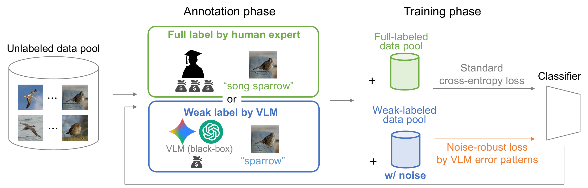

# Leveraging Vision-Language Models as Weak Annotators in Active Learning

[Phuong Ngoc Nguyen](https://arxiv.org/search/cs?searchtype=author&query=Nguyen,+P+N),
[Kaito Shiku](https://arxiv.org/search/cs?searchtype=author&query=Shiku,+K),
[Ryoma Bise](https://arxiv.org/search/cs?searchtype=author&query=Bise,+R),
[Seiichi Uchida](https://arxiv.org/search/cs?searchtype=author&query=Uchida,+S),
[Shinnosuke Matsuo](https://arxiv.org/search/cs?searchtype=author&query=Matsuo,+S)



[Overview PDF](image/Overview.pdf)

Active learning aims to reduce annotation cost by selectively querying
informative samples for supervision under a limited labeling budget. In this
work, we investigate how vision-language models (VLMs) can be leveraged to
further reduce the reliance on costly human annotation within the active
learning paradigm. To this end, we find that the reliability of VLMs varies
significantly with label granularity in fine-grained recognition tasks: they
perform poorly on fine-grained labels but can provide accurate coarse-grained
labels. Leveraging this property, we propose an active learning framework that
combines fine-grained human annotations with coarse-grained VLM-generated weak
labels through instance-wise label assignment. We further model the systematic
noise in VLM-generated labels using a small set of trusted full labels.
Experiments on CUB200 and FGVC-Aircraft show that the proposed framework
consistently outperforms existing active learning methods under the same
annotation budget.

This repository is an unofficial research extension of
[Instance-wise Supervision-level Optimization in Active Learning (ISOAL)](https://github.com/matsuo-shinnosuke/ISOAL)
by Matsuo et al., CVPR 2025. The original ISOAL framework selects both the
instances to annotate and the supervision level for each selected instance under
an annotation budget. This repository keeps that active-learning core and adds
experiments with VLM-derived weak labels and optional noisy-label correction.

## Main Additions

- Support for CUB200 and FGVC-Aircraft.
- Gemini/VLM weak-label generation for both datasets.
- Optional VLM weak labels through `--no_vlm_labels`.
- Optional transition matrix and forward correction through `--no_transition_matrix`.
- Dataset-specific round-0 full-label seed files.
- Additional backbones through `timm`, including ViT and ConvNeXt.

## Repository Layout

```text
src/
  run.py           # Main training entrypoint
  arguments.py     # Training arguments
  loader.py        # Dataset split and DataLoader setup
  ISO.py           # ISO query strategy and expected-improvement estimation
  train_nn.py      # Weak/full-head training and testing
  model.py         # Backbone and prediction heads
  cub200.py        # CUB200 dataset loader
  aircraft.py      # FGVC-Aircraft dataset loader
  vlm_labeler.py   # Gemini/VLM label generation
```

Generated files such as datasets, VLM labels, result logs, NumPy arrays, and
model checkpoints are intentionally ignored by Git.

## Setup

Install PyTorch for your CUDA environment first. For example:

```bash
pip install torch torchvision torchaudio --index-url https://download.pytorch.org/whl/cu118
pip install -r requirements.txt
```

All commands below assume:

```bash
cd src
```

## Generate VLM Weak Labels

Set your Gemini API key outside the source code:

```bash
export GEMINI_API_KEY="your_key_here"
```

Generate weak labels for CUB200:

```bash
python vlm_labeler.py --dataset cub200 --label_type weak
```

This creates:

```text
result/cub_predicted_weak_labels.npy
```

Generate weak labels for FGVC-Aircraft:

```bash
python vlm_labeler.py --dataset aircraft --label_type weak
```

This creates:

```text
result/air_predicted_weak_labels.npy
```

The training pipeline currently consumes predicted weak-label files. Full-label
VLM generation is supported by `vlm_labeler.py`, but it is not used by
`run.py` by default.

## Training Modes

### 1. ISOAL-style baseline

No Gemini/VLM weak labels and no transition matrix:

```bash
python run.py \
  --dataset cub200 \
  --budget 150 \
  --cost_weak 0.1 \
  --model_backbone vit_b_16 \
  --lr 3e-05 \
  --seed 0 \
  --num_rounds 6 \
  --no_vlm_labels \
  --no_transition_matrix \
  --output_dir result_cub_isoal/
```

### 2. VLM weak labels without transition matrix

```bash
python run.py \
  --dataset cub200 \
  --budget 150 \
  --cost_weak 0.02 \
  --model_backbone vit_b_16 \
  --lr 3e-05 \
  --seed 0 \
  --num_rounds 6 \
  --no_transition_matrix \
  --output_dir result_cub_vlm_noT/
```

### 3. VLM weak labels with transition matrix

```bash
python run.py \
  --dataset cub200 \
  --budget 150 \
  --cost_weak 0.02 \
  --model_backbone vit_b_16 \
  --lr 3e-05 \
  --seed 0 \
  --num_rounds 6 \
  --output_dir result_cub_vlm_T/
```

For FGVC-Aircraft, replace:

```text
--dataset cub200
```

with:

```text
--dataset aircraft
```

## Outputs

Round-0 full-label seeds and transition matrices are dataset-specific:

```text
result/round0_full_cub.npy
result/transition_matrix_round0_cub.npy
result/round0_full_air.npy
result/transition_matrix_round0_air.npy
```

Use separate `--output_dir` values for different experiments to avoid
overwriting logs and histories.

## Acknowledgement

This codebase is built upon the original ISOAL implementation:

- Original repository: https://github.com/matsuo-shinnosuke/ISOAL
- Original paper: Instance-wise Supervision-level Optimization in Active Learning, CVPR 2025

Please cite the original ISOAL paper if you use this repository.

```bibtex
@inproceedings{matsuo2025isoal,
  title = {Instance-wise Supervision-level Optimization in Active Learning},
  author = {Shinnosuke Matsuo and Riku Togashi and Ryoma Bise and Seiichi Uchida and Masahiro Nomura},
  booktitle = {Computer Vision and Pattern Recognition},
  year = {2025},
}
```

## License Note

The upstream ISOAL repository does not include an explicit license file in the
local copy used for this work. Before redistributing or relicensing this
repository, check the license status of the original project and follow its
terms.
